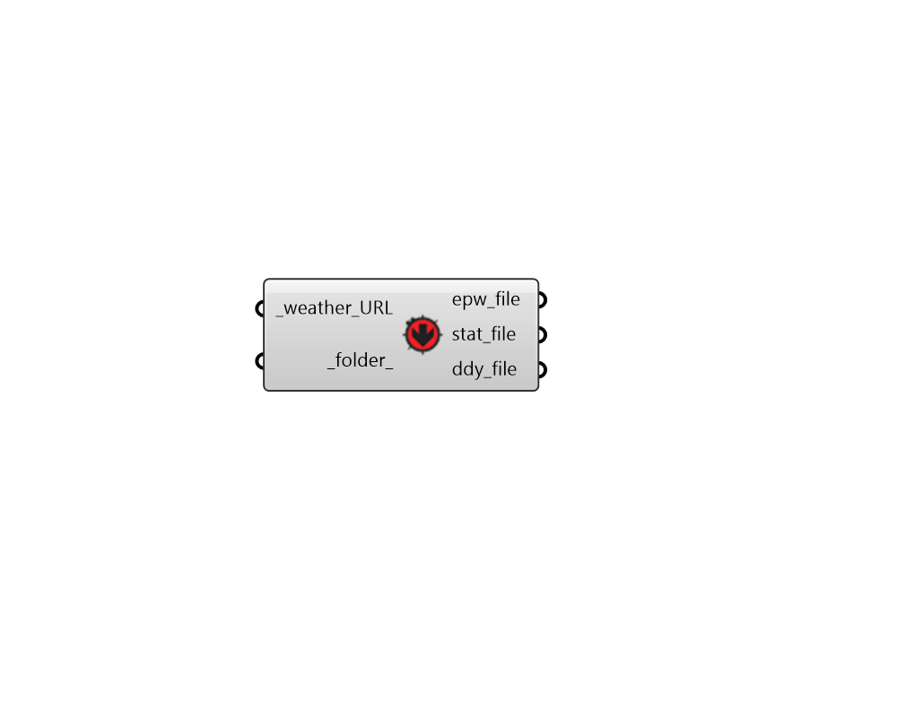

# Download Weather

 - [\[source code\]](https://github.com/ladybug-tools/ladybug-grasshopper/blob/master/ladybug_grasshopper/src//LB%20Download%20Weather.py)

Automatically download a .zip file from a URL where climate data resides, unzip the file, and open .epw, .stat, and ddy weather files.

## Inputs

* **weather\_URL \[Required\]**

  Text representing the URL at which the climate data resides.  To open the a map interface for all publicly availabe climate data \(epwmap\), use the "EPWmap" component. 

* **folder**

  An optional file path to a directory into which the weather file will be downloaded and unziped.  If None, the weather files will be downloaded to the ladybug default weather data folder and placed in a sub-folder with the name of the weather file location. 

## Outputs

* **epw\_file**

  The file path of the downloaded epw file. 

* **stat\_file**

  The file path of the downloaded stat file. 

* **ddy\_file**

  The file path of the downloaded ddy file. 

