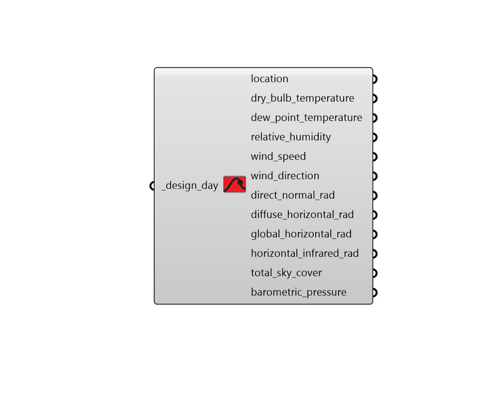

# Import Design Day

 - [\[source code\]](https://github.com/ladybug-tools/ladybug-grasshopper/blob/master/ladybug_grasshopper/src//LB%20Import%20Design%20Day.py)

Import hourly climate data from a Ladybug DesignDay object.

## Inputs

* **design\_day \[Required\]**

  A DesignDay object to import. 

## Outputs

* **location**

  A Ladybug Location object describing the location of the design day. 

* **dry\_bulb\_temperature**

  The houlry dry bulb temperature over the design day, in C. 

* **dew\_point\_temperature**

  The hourly dew point temperature over the design day, in C. 

* **relative\_humidity**

  The hourly Relative Humidity over the design day in percent. 

* **wind\_speed**

  The hourly wind speed over the design day in m/sec. 

* **wind\_direction**

  The hourly wind direction over the design day in degrees. The convention is that North=0.0, East=90.0, South=180.0, West=270.0. 

* **direct\_normal\_rad**

  The hourly Direct Normal Radiation over the design day in Wh/m2. 

* **diffuse\_horizontal\_rad**

  The hourly Diffuse Horizontal Radiation over the design day in Wh/m2. 

* **global\_horizontal\_rad**

  The hourly Global Horizontal Radiation over the design day in Wh/m2. 

* **horizontal\_infrared\_rad**

  The Horizontal Infrared Radiation Intensity over the design day in Wh/m2. 

* **total\_sky\_cover**

  The fraction for total sky cover over the design day in tenths of coverage. 

* **barometric\_pressure**

  The hourly weather station pressure over the design day in Pa. 

