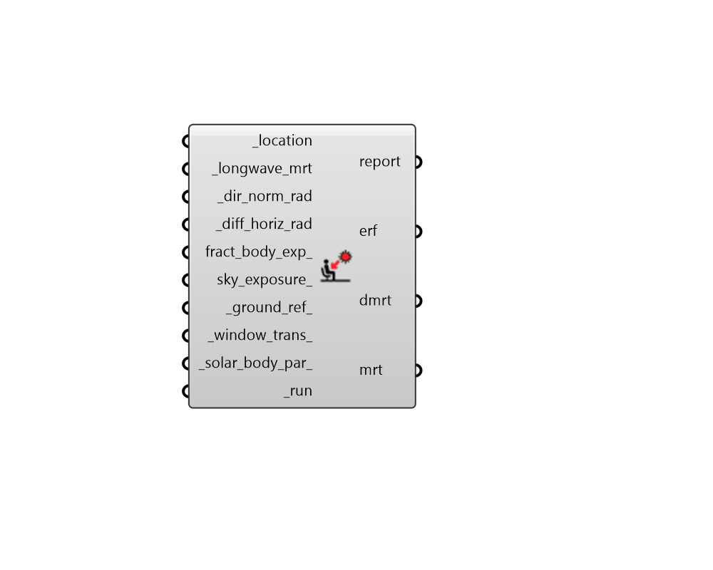

# Indoor Solar MRT

 - [\[source code\]](https://github.com/ladybug-tools/ladybug-grasshopper/blob/master/ladybug_grasshopper/src//LB%20Indoor%20Solar%20MRT.py)

Calculate Mean Radiant Temperature \(MRT\) as a result of outdoor shortwave solar shining directly onto people as well as longwave radiant exchange with the sky.

This component uses the SolarCal model of ASHRAE-55 to estimate the effects of shortwave solar and a simple sky exposure method to determine longwave radiant exchange.

## Inputs

* **location \[Required\]**

  A Ladybug Location object, used to determine the altitude and azimuth of the sun. 

* **longwave\_mrt \[Required\]**

  A single number or an hourly data collection with the long-wave mean radiant temperature around the person in degrees C. This includes the temperature of the ground and any other surfaces between the person and their view to the sky. Typically, indoor air temperature is used when such surface temperatures are unknown. 

* **dir\_norm\_rad \[Required\]**

  Hourly Data Collection with the direct normal solar irradiance in W/m2. 

* **diff\_horiz\_rad \[Required\]**

  Hourly Data Collection with diffuse horizontal solar irradiance in W/m2. 

* **fract\_body\_exp**

  A single number between 0 and 1 or a data collection for the fraction of the body exposed to direct sunlight. The "LB Human to Sky Relationship" component can be used to estimate this input for a given set of context geometry and position of the human. Note that this parameter does NOT include the body’s self-shading. It only includes the shading from furniture and surroundings. \(Default: 1 for an area surrounded by glass\). 

* **sky\_exposure**

  A single number between 0 and 1 or a data collection representing the fraction of the sky vault in the human subject’s view. The "LB Human to Sky Relationship" component can be used to estimate this input for a given set of context geometry and position of the human. \(Default: 0.5 for a person next to an all glass facade\). 

* **ground\_ref**

  A single number between 0 and 1 or a data collection that represents the reflectance of the floor. Default is for 0.25 which is characteristic of concrete. 

* **window\_trans**

  A Data Collection or number between 0 and 1 that represents the broadband solar transmittance of the window through which the sun is coming. Such values tend to be slightly less than the SHGC. Values might be as low as 0.2 and could be as high as 0.85 for a single pane of glass. Default is 0.4 assuming a double pane window with a relatively mild low-e coating. 

* **solar\_body\_par**

  Optional solar body parameters from the "LB Solar Body Parameters" object to specify the properties of the human geometry assumed in the shortwave MRT calculation. The default assumes average skin/clothing absorptivity and a human subject always has their back to the sun at a 45-degree angle \(SHARP = 135\). 

* **run \[Required\]**

  Set to True to run the component. 

## Outputs

* **report**

  Reports, errors, warnings, etc. 

* **erf**

  Data collection of effective radiant field \(ERF\) in W/m2. 

* **dmrt**

  Data collection of mean radiant temperature delta in C. 

* **mrt**

  Data collection of mean radiant temperature in C. 

